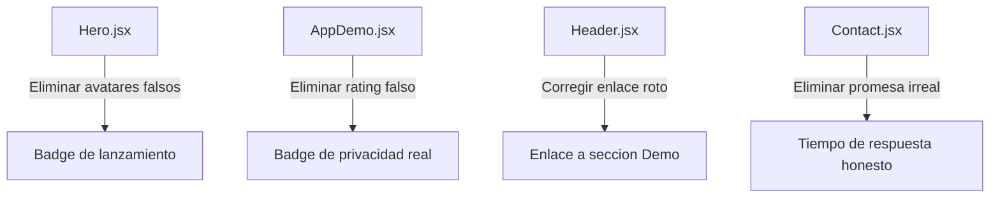

# Plan: Eliminar Social Proof Falso en Evalix Website

## Contexto
Evalix es un producto nuevo sin usuarios reales. El sitio actual contiene varios elementos que simulan una base de usuarios existente (avatares de usuarios, ratings, conteos de usuarios, soporte 24/7), lo cual es engañoso y puede dañar la credibilidad cuando los visitantes reales lleguen al sitio.

## Elementos a Cambiar

---

### 1. `Hero.jsx` — Bloque de avatares y "+1k docentes"

**Problema (líneas 47–58):**
```jsx
<div className='flex items-center gap-4 text-sm font-medium text-slate-500'>
  <div className='flex -space-x-3'>
    {[1, 2, 3, 4].map((i) => (
      <div ... style={{backgroundImage: `url('https://i.pravatar.cc/100?img=${i + 10}')`}}>
      </div>
    ))}
    <div ...>+1k</div>
  </div>
  <p>Usado por docentes innovadores</p>
</div>
```

**Propuesta de reemplazo:**
Reemplazar el bloque de avatares + "+1k" por un badge de lanzamiento que destaque que es la versión 1.0 y que invite a ser de los primeros en usarla. Opciones:

**Opción A — Badge "Sé el primero":**
```jsx
<div className='flex items-center gap-4 text-sm font-medium text-slate-500'>
  <div className='flex items-center gap-3 bg-blue-50 border border-blue-100 px-4 py-2 rounded-full'>
    <span className='relative flex h-2 w-2'>
      <span className='animate-ping absolute inline-flex h-full w-full rounded-full bg-blue-400 opacity-75'></span>
      <span className='relative inline-flex rounded-full h-2 w-2 bg-[#0B3D91]'></span>
    </span>
    <p className='text-[#0B3D91] font-semibold'>Lanzamiento oficial — Sé de los primeros</p>
  </div>
</div>
```

**Opción B — Propuesta de valor técnica:**
```jsx
<div className='flex items-center gap-4 text-sm font-medium text-slate-500'>
  <div className='flex items-center gap-3'>
    <CheckCircle2 className='w-5 h-5 text-emerald-500' />
    <p>Procesamiento 100% local · Sin servidores externos</p>
  </div>
</div>
```

**Recomendación:** Opción A — mantiene el tono de urgencia/exclusividad sin mentir.

---

### 2. `AppDemo.jsx` — Rating "4.9/5 por docentes" y avatares

**Problema (líneas 432–437):**
```jsx
<div className="flex justify-center flex-col md:items-start items-center">
  <div className="flex -space-x-2 mb-2">
    {[1,2,3].map(i => <div key={i} ...></div>)}
  </div>
  <p className="text-slate-600 text-sm font-medium">Calificado con 4.9/5 por docentes</p>
</div>
```

**Propuesta de reemplazo:**
Reemplazar el bloque de avatares + rating por una propuesta de valor técnica real que ya tiene el producto:

```jsx
<div className="flex justify-center flex-col md:items-start items-center">
  <div className="flex items-center gap-2 mb-2">
    <ShieldCheck className="w-5 h-5 text-emerald-500" />
    <span className="text-emerald-600 font-bold text-sm">Verificado</span>
  </div>
  <p className="text-slate-600 text-sm font-medium">Procesamiento local · Sin datos en la nube</p>
</div>
```

**Alternativa — Destacar compatibilidad:**
```jsx
<div className="flex justify-center flex-col md:items-start items-center">
  <div className="flex items-center gap-2 mb-2">
    <Smartphone className="w-5 h-5 text-[#0B3D91]" />
  </div>
  <p className="text-slate-600 text-sm font-medium">Compatible con Android 8.0 en adelante</p>
</div>
```

**Recomendación:** Primera opción — refuerza el diferenciador de privacidad que ya tiene el producto.

---

### 3. `Header.jsx` — Enlace "Resultados" sin sección real

**Problema (línea 9):**
```jsx
{ name: 'Resultados', href: '#results' },
```
No existe ninguna sección con `id="results"` en el sitio. El enlace lleva a ningún lado.

**Propuesta de reemplazo:**
Cambiar por un enlace a la sección de demo que sí existe (`#demo`), o a la sección de exámenes personalizados (`#custom-exams`):

```jsx
const navigation = [
  { name: 'Características', href: '#features' },
  { name: 'Cómo funciona', href: '#how-it-works' },
  { name: 'Demo', href: '#demo' },
  { name: 'Precios', href: '#pricing' },
]
```

**Recomendación:** Reemplazar "Resultados" → "Demo" ya que la sección `#demo` es la más visual e impactante del sitio.

---

### 4. `Contact.jsx` — "Chat en vivo 24/7"

**Problema (líneas 27–35):**
```jsx
<div className='flex items-center gap-6'>
  <div className='w-14 h-14 bg-white/10 rounded-2xl flex items-center justify-center'>
    <MessageSquare className='w-6 h-6' />
  </div>
  <div>
    <p className='text-blue-200 text-sm font-semibold uppercase tracking-widest'>Soporte</p>
    <p className='text-xl font-bold italic'>Chat en vivo 24/7</p>
  </div>
</div>
```
"Chat en vivo 24/7" implica un equipo de soporte disponible en todo momento, lo cual no es realista para un producto nuevo.

**Propuesta de reemplazo:**
Cambiar a algo honesto y alcanzable, como tiempo de respuesta por email o soporte vía WhatsApp:

**Opción A — Respuesta por email:**
```jsx
<div>
  <p className='text-blue-200 text-sm font-semibold uppercase tracking-widest'>Soporte</p>
  <p className='text-xl font-bold italic'>Respuesta en menos de 24h</p>
</div>
```

**Opción B — WhatsApp (más cercano para México):**
```jsx
<div>
  <p className='text-blue-200 text-sm font-semibold uppercase tracking-widest'>WhatsApp</p>
  <p className='text-xl font-bold italic'>Soporte directo por mensaje</p>
</div>
```

**Recomendación:** Opción A — es honesta, profesional y no requiere infraestructura adicional.

---

## Resumen de Cambios

| Archivo | Líneas | Problema | Cambio Propuesto |
|---------|--------|----------|-----------------|
| `Hero.jsx` | 47–58 | Avatares falsos + "+1k docentes" | Badge "Sé de los primeros" con dot animado |
| `AppDemo.jsx` | 432–437 | Avatares falsos + "4.9/5 por docentes" | Badge de privacidad/verificación real |
| `Header.jsx` | 9 | Enlace "Resultados" → `#results` inexistente | Cambiar a "Demo" → `#demo` |
| `Contact.jsx` | 33 | "Chat en vivo 24/7" | "Respuesta en menos de 24h" |

## Flujo de Cambios



## Notas Adicionales

- El badge de "Evalix 1.0 ya está aquí" en `Hero.jsx` (línea 23) es correcto y debe mantenerse — es honesto sobre el estado del producto.
- La sección de precios con planes y el slider de institutos son correctos — no implican usuarios existentes.
- El texto "Empieza gratis con la versión demo" en `Pricing.jsx` (línea 105) es válido si la demo es funcional.
- El `AppDemo.jsx` tiene una demo interactiva muy bien hecha que sí muestra las capacidades reales del producto — es el mejor argumento de venta.
